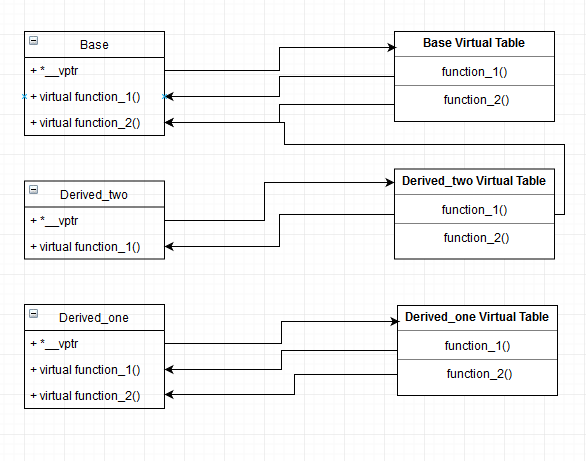

# Polymorphism

## Đa hình

Là hiện tượng các đối tượng thuộc các lớp khác nhau có khả năng hiểu cùng một thông điệp theo các cách khác nhau.

Ví dụ: quản lý danh sách các smartphone (có thể) có hệ điều hành khác nhau như Android, IOS, Windowphone.

Để giải quyết ví dụ trên, chúng ta quan tâm 2 hoạt động: lưu trữ và thao tác xử lý

- Lưu trữ: thao tác trên mảng, các thư viện (vector, list, …)
- Thao tác xử lý: phải đảm bảo tính đa hình (vì các loại đối tượng khác nhau sẽ phải dùng thao tác xử lý khác nhau). Để làm được chúng ta có 2 cách: vùng chọn kiểu và phương thức ảo

## I, Cách thông thường (không áp dụng đa hình)

Trong trường hợp này chúng ta sẽ dùng con trỏ (giảm đi bước khởi tạo nhiều đối tượng vì con trỏ đối tượng của lớp cha tham chiếu được đến đối tượng kiểu lớp con thông qua con trỏ):

```cpp
#include <iostream>
#include <string>
using namespace std;

class SmartPhone
{
protected:
    string Ten;  // Tên điện thoại
    string Hang; // Hãng sản xuất

public:
    SmartPhone();
    SmartPhone(string t, string h)
    {
        this->Ten = t;
        this->Hang = h;
    }
    void Display()
    {
        cout << "SmartPhone " << Ten << " thuoc hang " << Hang << endl;
    }
};

class Android : public SmartPhone
{
private:
    // Thuộc tính gì gì đó =)
    int playStore;

public:
    Android(int s, string t, string n) : SmartPhone(t, n)
    {
        playStore = s;
    }
    void Display()
    {
        cout << "Android co ten " << Ten << " thuoc hang " << Hang << endl;
    }
};

class IOS : public SmartPhone
{
private:
    // Thuộc tính gì gì đó =)
    int appleStore;

public:
    IOS(int s, string t, string n) : SmartPhone(t, n)
    {
        appleStore = s;
    }
    void Display()
    {
        cout << "IOS co ten " << Ten << " thuoc hang " << Hang << endl;
    }
};

class WindowPhone : public SmartPhone
{
private:
    // Thuộc tính gì gì đó =)
    int mStore;

public:
    WindowPhone(int s, string t, string n) : SmartPhone(t, n)
    {
        mStore = s;
    }
    void Display()
    {
        cout << "WindowPhone co ten " << Ten << " thuoc hang " << Hang << endl;
    }
};

int main()
{
    const int sl = 3; // số lượng sản phẩm

    SmartPhone *sp[sl];
    sp[0] = new Android(1, "Redmi note 8", "Xiaomi");
    sp[1] = new IOS(2, "Iphone XS Max", "Apple");
    sp[2] = new WindowPhone(3, "Microsoft Lumia", "Microsoft");

    // Xuất sản phẩm
    for (int i = 0; i < 3; i++)
    {
        sp[i]->Display();
    }
    return 0;
}
```

> Sử dụng con trỏ sẽ tiện lợi hơn rất nhiều, không cần phải tạo cả 3 đối tượng cho 3 class mà chỉ cần 1 con trỏ đối tượng lớp cha. Tuy nhiên con trỏ đối tượng lớp cha chỉ gọi hàm `Display()` của lớp cha mặc dù đã được tham chiếu đến đối tượng của lớp con (mặc dù trong lớp con đã định nghĩa lại hàm `Display()`).

## II, Sử dụng vùng chọn kiểu

Để nhận diện được đối tượng của class nào, chúng ta sẽ thêm một vùng dữ liệu (thuộc tính) vào class cơ sở, sao cho giá trị của vùng chọn kiểu giữa các class đối tượng là khác nhau. Phổ biến trong phương pháp nào nhất chính là sử dụng kiểu dữ liệu `enum`.

```cpp
#include <iostream>
#include <string>
using namespace std;

enum TYPE
{
    PHONE,
    ANDROID,
    IOS,
    WINDOWPHONE
};

class SmartPhone
{
protected:
    string Ten;  // Tên điện thoại
    string Hang; // Hãng sản xuất

public:
    TYPE loai;
    SmartPhone();
    SmartPhone(string t, string h) : loai(PHONE)
    {
        this->Ten = t;
        this->Hang = h;
    }
    void Display()
    {
        cout << "SmartPhone " << Ten << " thuoc hang " << Hang << endl;
    }
};

class Android : public SmartPhone
{
private:
    int playStore;

public:
    Android(int s, string t, string h) : SmartPhone(t, h)
    {
        playStore = s;
        loai = ANDROID;
    }
    void Display()
    {
        cout << "Android co ten " << Ten << " thuoc hang " << Hang << endl;
    }
};

class Ios : public SmartPhone
{
private:
    int appleStore;

public:
    Ios(int s, string t, string h) : SmartPhone(t, h)
    {
        appleStore = s;
        loai = IOS;
    }
    void Display()
    {
        cout << "Ios co ten " << Ten << " thuoc hang " << Hang << endl;
    }
};

class WindowPhone : public SmartPhone
{
private:
    int mStore;

public:
    WindowPhone(int s, string t, string h) : SmartPhone(t, h)
    {
        mStore = s;
        loai = WINDOWPHONE;
    }
    void Display()
    {
        cout << "WindowPhone co ten " << Ten << " thuoc hang " << Hang << endl;
    }
};

int main()
{
    const int sl = 3; // số lượng sản phẩm

    SmartPhone *sp[sl];
    sp[0] = new Android(1, "Redmi note 8", "Xiaomi");
    sp[1] = new Ios(2, "Iphone XS Max", "Apple");
    sp[2] = new WindowPhone(3, "Microsoft Lumia", "Microsoft");

    // Xuất sản phẩm
    for (int i = 0; i < 3; i++)
    {
        switch (sp[i]->loai)
        {
        case ANDROID:
            ((Android *)sp[i])->Display();
            break;
        case IOS:
            ((Ios *)sp[i])->Display();
            break;
        case WINDOWPHONE:
            ((WindowPhone *)sp[i])->Display();
            break;
        }
    }

    return 0;
}
```

> Cách này khá dài dòng, khó sử lỗi cũng như bảo trì, nâng cấp.

### III, Sử dụng phương thức ảo

Đây là cách chính thống để thể hiện tính đa hình trong C++, các phương thức ở lớp cơ sở có tính đa hình phải được định nghĩa là phương thức ảo.

Con trỏ của đối tượng lớp cha không thể truy xuất hàm `Display()` ở lớp con. Tuy nhiên ta sẽ làm cho nó thực hiện được bằng cách biến phương thức `Display()` thành phương thức ảo (virtual).

```cpp
virtual void Display()
{
    cout << "SmartPhone " << Ten << " thuoc hang " << Hang << endl;
}

```

**Lưu ý khi dùng phương thức ảo**:

- Phương thức ảo chỉ hoạt động thông qua con trỏ
- Để 1 phương thức trở thành phương thức ảo:
  - Đặt từ khóa virtual trước khai báo (ở lớp cha)
  - Phương thức tương ứng ở lớp cha đã là phương thức ảo
- Phương thức ảo chỉ hoạt động khi phương thức ở lớp cha và lớp con có nghi thức giao tiếp giống nhau (kiểu trả về, tên, tham số)
- Nếu ở lớp con không định nghĩa lại phương thức ảo, trình biên dịch sẽ gọi phương thức ảo gần nhất ở lớp cha.

> Khi gọi một phương thức, khả năng chọn đúng phiên bản tùy theo đối tượng để thực hiện thông qua con trỏ đến lớp cơ sở được gọi là tính đa hình (polymorphisms).

## IV, Hàm hủy ảo (virtual destructor)

Khi lớp có thuộc tính cấp phát động (con trỏ) thì ta cần phải xây dựng destructor để làm nhiệm vụ dọn dẹp vùng nhớ và trả lại cho hệ điều hành (C++ không có cơ chế tự động thu dọn).

Khi sử dụng kế thừa (inheritance) và đa hình (polymorphism) chúng ta nên sử dụng hàm hủy ảo vì destructor bình thường (không có virtual) chương trình chỉ gọi destructor của lớp cha mà bỏ qua destructor ở lớp con. Vì đối tượng lớp cha là con trỏ nên khi hủy chương trình sẽ xem xét có hàm hủy ảo hay không, nếu không thì nó giả định rằng chỉ cần gọi constructor của lớp cha là được dẫn đến thuộc tínhcon trỏ ở lớp con không được dọn dẹp vùng nhớ!

```cpp
#include <iostream>
using namespace std;

class Base
{
public:
    virtual ~Base()
    {
        cout << "Base destructor..." << endl;
    }
};

class Derived : public Base
{
    int *arr;
    int length;

public:
    Derived(int l)
    {
        arr = new int[l];
    }
    virtual ~Derived()
    {
        if (arr)
            delete arr;
        cout << "Derived destructor..." << endl;
    }
};

int main()
{
    Base *ptr = new Derived(5);
    // Ta phải tự delete do C++ không tự hủy con trỏ.
    delete ptr;
    return 0;
}
```

Kết quả:

```cpp
Derived destructor...
Base destructor...
```

> Bất cứ khi nào bạn dùng kế thừa, nên chắc chắn destructor của bạn là virtual destructor. Khi khai báo virtual ở lớp cơ sở thì mặc định destructor ở các lớp con cũng là virtual destructor (dù bạn có khởi tạo nó hay không).

## V, Cơ chế hoạt động của phương thức ảo

Cơ chế đa hình (phương thức ảo) được thực hiện nhờ ở mỗi đối tượng có thêm một bảng phương thức ảo (virtual table).

Bảng ảo đơn giản là 1 mảng tĩnh được trình biên dịch khởi tạo ngầm định khi thiết lập đối tượng, bảng ảo sẽ chứa các mục (entry) và trong mỗi mục sẽ chứa con trỏ hàm (function pointer) - con trỏ hàm này sẽ trỏ đến phương thức ảo(mà gần nhất với class đó - most derived).

Tiếp theo, trình biên dịch sẽ tạo ra 1 con trỏ ẩn đặt trong lớp cha (với tên `__vptr`), lưu ý là con trỏ này khác với con trỏ `this` chúng ta hay dùng trong class vì thế nó sẽ khiến mỗi đối tượng của lớp đó có kích thước lớn (đối tượng của lớp không có hàm ảo) 1 con trỏ và con trỏ `__vptr` cũng sẽ được các lớp con kế thừa.

**Xét ví dụ**:

```cpp
#include <iostream>
using namespace std;

class Base
{
    // FunctionPointer *__vptr; sẽ được trình biên dịch ngầm tạo ra
    virtual void function_1(){};
    virtual void function_2(){};
};

class Derived_one : public Base
{
public:
    Derived_one();
    void function_1(){};
    void function_2(){};
};

class Derived_two : public Base
{
public:
    Derived_two();
    void function_1(){};
};

int main()
{
    // Tạo đối tượng class Base __vptr sẽ trỏ đến bảng ảo của class Base
    Base *a;

    return 0;
}
```

Khi một đối tượng của lớp được tạo, con trỏ `__vptr` sẽ trỏ đến bảng ảo của lớp đó, tiếp theo là việc bỏ dữ liệu vào bảng ảo.

Trong ví dụ trên chúng ta có 2 hàm ảo (`function_1`, `function_2`) nên bảng ảo sẽ có 2 mục (1 cho `function_1` và 1 cho `function_2`):

- Đối với lớp Base (lớp cha): đối tượng của lớp cha không thể truy cập đến các hàm của `Derived_one` và `Derived_two`, do đó mục cho `function_1` sẽ trỏ đến `Base::function_1()` và mục cho `function_2` thì trỏ đến `Base::function_2()`.
- Đối với lớp `Derived_one`: đối tượng của lớp con có thể truy cập các thành phần của lớp đó và cả lớp cha, tức là mục trong bảng ảo có thể trỏ đến 2 hàm của lớp cha hoặc 2 hàm của chính lớp đó. Tuy nhiên mục (chứa con trỏ hàm) sẽ trỏ đến phương thức ảo mà gần nó nhất (most-derived) cho nên  mục cho `function_1` sẽ trỏ đến `Derived_one::function_1()` và mục cho `function_2` thì trỏ đến `Derived_one::function_2()`.
- Đối với `Derived_two`: đặc điểm tương tự như lớp `Derived_one`, nhưng ở lớp này ta chỉ định nghĩa lại hàm `function_1()` nên ở mục cho `function_2` con trỏ hàm sẽ trỏ về `Base::function_2()`. Cụ thể: mục cho `function_1` sẽ trỏ đến `Derived_two::function_1()` và mục cho `function_2` thì trỏ đến `Base::function_2()`.



**Gọi phương thức ảo từ con trỏ lớp cha**:

```cpp
Base *bptr;
bptr = new Derived_one();
bptr->function_one();
```

- Khi trỏ đến 1 đối tượng của lớp con, con trỏ `bptr` cũng có quyền truy cập đến con trỏ `__vptr` của `Derived_one` -> cũng có quyền truy cập vào `virtual table` của lớp `Derived_one` thông qua `__vptr`.
- Khi gọi đến phương thức ảo `function_one`, chương trình nhận diện hàm này là hàm ảo -> thông qua `bptr` truy cập vào bảng ảo của lớp `Derived_one` -> tìm kiếm 1 phiên bản của `function_one` trong bảng ảo để gọi ra -> lúc này trong mục `function_one` đang trỏ đến `Derived_one::function_one()` -> gọi hàm `Derived_one::function_one()`.

> Nhận xét: gọi hàm ảo tốn thời gian hơn gọi hàm thường (qua nhiều bước) và đối tượng của lớp có hàm ảo có kích thước lớn hơn (đối tượng của lớp không có hàm ảo) 1 con trỏ (do chứa `__vptr`).

## VI, Phương thức thuần ảo

Có những phương thức ở cơ sở không có ý nghĩa về mặt nội dung nhưng lại cần phải khai báo để các lớp con kế thừa.

Phương thức thuần ảo là 1 phương thức ảo (virtual) nhưng không có nội dung (không có thân hàm) và được khai báo bằng cách gán giá trị 0.

```cpp
class Shape {
    public:
    virtual void Draw() = 0;
};
```

> Chỉ có hàm ảo (có từ khóa virtual) mới được phép gán giá trị 0.

**Lưu ý**:

- Nếu một lớp có một hoặc nhiều phương thức thuần ảo thì lớp đó được gọi là lớp cơ sở trừu tượng (abstract base class).
- Không thể khởi tạo 1 đối tượng thuộc lớp cơ sở trừu tượng.
- Nếu lớp con kế thừa từ lớp cha (với lớp cha là một lớp cơ sở trừu tượng) thì lớp con bắt buộc phải định nghĩa thân hàm cho hàm thuần ảo. Nếu không làm (hoặc thiếu) lớp con đó sẽ được xem như là một lớp cơ sở trừu tượng.
